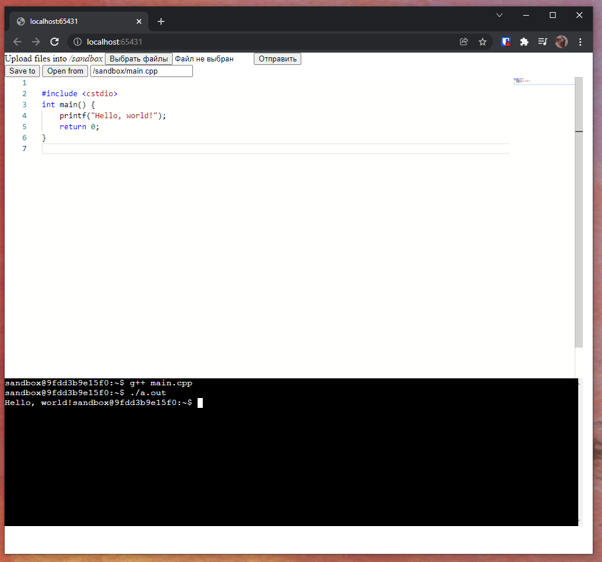

# Interactive C++ playground

Proof-of-concept for a minimal C++ playground, powered by docker

## Setup

* Copy `stub.env` to `.env`
* Configure connection to docker in `.env`-file
* Run `npm i` to install packages
* Run `node ./server/index.js` to start backend on `localhost:3000`
* Open `index.html` in web-browser